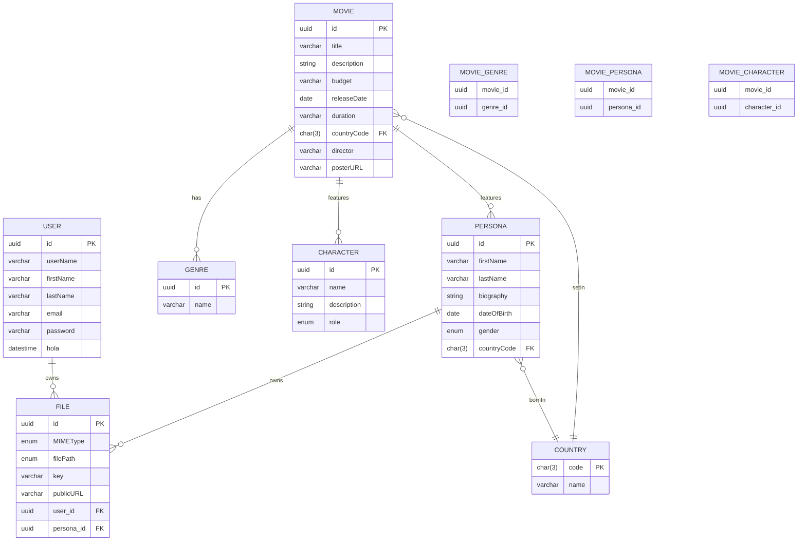

# lecture-starter-DB-SQL
Binary Studio Code Bootcamp 2024 DB and SQL

PostgreSQL DB Setup: 
create DB run: `psql postgres -f ddl.statements.sql`
populate DB run: `psql movies_exercise_db -f populate.tables.sql`
first query run: `psql movies_exercise_db -f firstQuery.sql`
second query run: `psql movies_exercise_db -f secondQuery.sql`
third query run: `psql movies_exercise_db -f thirdQuery.sql`
fourth query run: `psql movies_exercise_db -f fourthQuery.sql`
fifth query run: `psql movies_exercise_db -f fifthQuery.sql`
sixth query run: `psql movies_exercise_db -f sixthQuery.sql`

